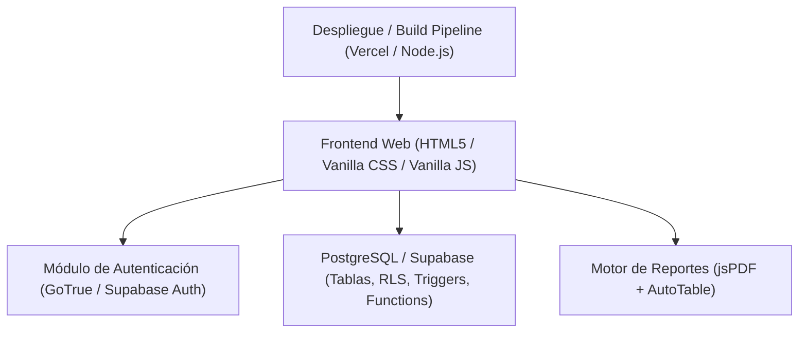
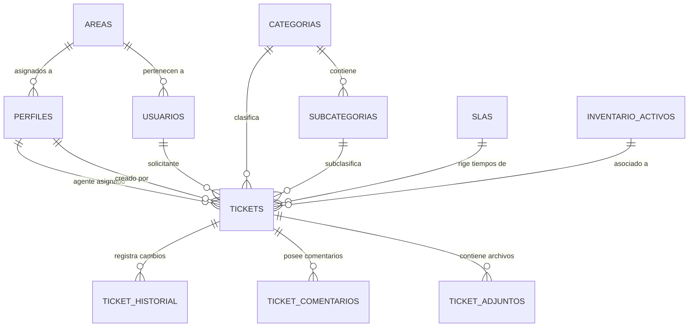
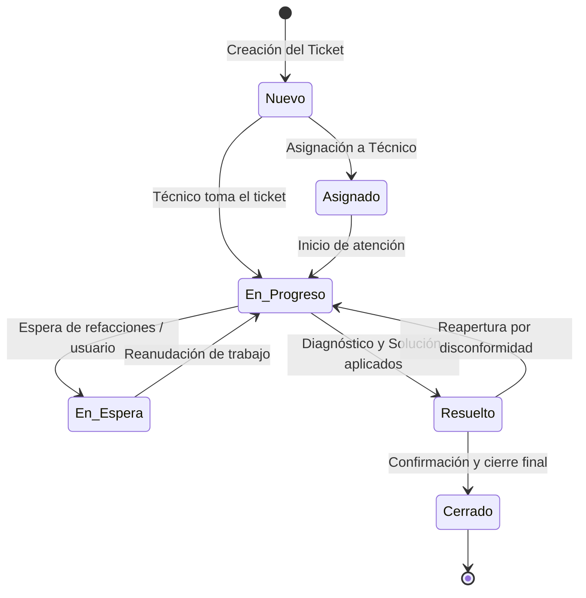

# SISTEMA DE TICKETS DE SOPORTE IT — DOCUMENTACIÓN TÉCNICA Y ESPECIFICACIÓN DEL SISTEMA (AGENTS.MD)

> **Documento Maestro de Arquitectura, Modelo de Datos y Especificación de Módulos (M1 a M6).**  
> *Este documento sirve como referencia técnica permanente para desarrolladores y agentes de IA. Debe actualizarse conforme el sistema evolucione.*

---

## 1. Visión General del Sistema

El **Sistema de Tickets de Soporte IT** es una plataforma web integral diseñada para centralizar, gestionar, auditar y optimizar el flujo de atención técnica a usuarios y departamentos dentro de una organización. Permite registrar incidencias, asignar prioridades, aplicar reglas de SLA, gestionar el catálogo de usuarios/áreas y emitir reportes ejecutivos.

### Objetivos Clave:
- **Trazabilidad completa**: Registro detallado de cada solicitud desde su apertura hasta el cierre definitivo.
- **Seguridad y Control de Acceso basado en Roles (RBAC)**: Diferenciación de perfiles (Administradores, Agentes de Soporte IT y Usuarios solicitantes).
- **Cumplimiento de Acuerdos de Nivel de Servicio (SLA)**: Monitoreo de tiempos de respuesta y resolución.
- **Base de Conocimiento y Diagnóstico**: Registro estructurado de problemas, diagnósticos y soluciones aplicadas para alimentar futuras consultas.
- **Rendición de Cuentas y Estadísticas**: Métricas semanales, tableros dinámicos y reportes exportables en formatos estándar (PDF/CSV).

---

## 2. Arquitectura de Software y Stack Tecnológico



### Tecnologías:
- **Frontend**:
  - **HTML5 Semántico**: Estructura modular, accesible y optimizada para lectores y buscadores.
  - **Vanilla CSS3**: Sistema de diseño con variables CSS (`:root`), soporte nativo de temas Claro/Oscuro (`data-theme`), componentes tipo tarjeta, modales y animaciones micro-interactivas.
  - **Vanilla JavaScript (ES6+)**: Lógica asíncrona modular sin dependencias pesadas de frameworks, garantizando alta velocidad de carga y bajo consumo de recursos.
- **Backend as a Service (BaaS) & Base de Datos**:
  - **Supabase**: PostgreSQL administrado.
  - **Supabase Auth (GoTrue)**: Autenticación por correo/contraseña y tokens JWT.
  - **Row Level Security (RLS)**: Reglas de seguridad a nivel de fila para aislamiento estricto de información.
  - **PostgreSQL Triggers & Functions**: Automatización de creación de perfiles y trazabilidad de cambios.
- **Generación de Documentos**:
  - `jsPDF (v2.5.2)` + `jspdf-autotable (v3.8.4)` para exportación client-side de reportes ejecutivos semanales.
- **Build & Despliegue**:
  - Node.js script (`build.js`) para inyección segura de variables de entorno hacia el directorio `dist/`.
  - Configuración optimizada para Vercel (`vercel.json`).

---

## 3. Modelo de Datos y Entidades Relacionales



### Diccionario de Entidades:

#### 1. `perfiles` (Cuentas de acceso al sistema)
Vinculado 1:1 con `auth.users` de Supabase mediante trigger.
- `id` (UUID, PK, FK `auth.users.id` ON DELETE CASCADE)
- `email` (TEXT, NOT NULL)
- `rol` (TEXT: `'admin'`, `'agente'`, `'usuario'`. Default: `'usuario'`)
- `area_id` (UUID, FK `areas.id`, NULLable para agentes/admins generales)
- `nombre_completo` (TEXT, NULLable)
- `created_at` (TIMESTAMPTZ)

#### 2. `areas` (Departamentos u oficinas de la organización)
- `id` (UUID, PK)
- `nombre` (TEXT, UNIQUE, NOT NULL)
- `descripcion` (TEXT, NULLable)
- `created_at` (TIMESTAMPTZ)

#### 3. `usuarios` (Personal atendido / Solicitantes finales)
- `id` (UUID, PK)
- `nombre` (TEXT, NOT NULL)
- `email` (TEXT, NULLable)
- `telefono` (TEXT, NULLable)
- `area_id` (UUID, FK `areas.id` ON DELETE CASCADE)
- `created_at` (TIMESTAMPTZ)

#### 4. `categorias` y `subcategorias` (Taxonomía técnica)
- `categorias`: `id` (UUID, PK), `nombre` (TEXT: ej. *Redes, Hardware, Sistemas, Telefonía*), `activo` (BOOLEAN).
- `subcategorias`: `id` (UUID, PK), `categoria_id` (UUID, FK `categorias.id`), `nombre` (TEXT: ej. *Impresoras, Conectividad WiFi, Correo institucional*).

#### 5. `tickets` (Núcleo operativo)
- `id` (UUID, PK)
- `folio` (TEXT, UNIQUE): Código legible (ej. `TIC-2026-001`).
- `usuario_id` (UUID, FK `usuarios.id`): Usuario que reporta el problema.
- `solicitante_perfil_id` (UUID, FK `perfiles.id`, NULLable): Cuenta del sistema que creó el ticket.
- `asignado_a` (UUID, FK `perfiles.id`, NULLable): Técnico o Agente asignado.
- `categoria_id` (UUID, FK `categorias.id`, NULLable).
- `subcategoria_id` (UUID, FK `subcategorias.id`, NULLable).
- `prioridad` (TEXT: `'baja'`, `'media'`, `'alta'`, `'critica'`. Default: `'media'`).
- `status` (TEXT: `'nuevo'`, `'asignado'`, `'en_progreso'`, `'en_espera'`, `'resuelto'`, `'cerrado'`. Default: `'nuevo'`).
- `problema` (TEXT, NOT NULL): Descripción detallada del reporte.
- `dx` (TEXT, NULLable): Diagnóstico técnico.
- `solucion` (TEXT, NULLable): Descripción de la solución o procedimiento ejecutado.
- `fecha` (DATE, NOT NULL, Default `CURRENT_DATE`).
- `sla_vencimiento` (TIMESTAMPTZ, NULLable): Timestamp límite para resolución.
- `fecha_cierre` (TIMESTAMPTZ, NULLable).
- `created_at` (TIMESTAMPTZ, Default `now()`).

#### 6. `ticket_historial` y `ticket_comentarios` (Auditoría y Comunicación)
- `ticket_historial`: Registro automático de transiciones de estado, reasignaciones y modificaciones.
- `ticket_comentarios`: Notas internas entre técnicos o respuestas al usuario con marcas temporales.

#### 7. `slas_reglas` (Configuración de niveles de servicio)
- `id` (UUID, PK), `prioridad` (TEXT), `tiempo_primera_respuesta_horas` (INT), `tiempo_resolucion_horas` (INT).

---

## 4. Flujo de Estados y Ciclo de Vida del Ticket



### Definición de Estados:
1. **Nuevo (`nuevo`)**: El ticket ha sido registrado pero aún no tiene técnico asignado ni atención en curso.
2. **Asignado (`asignado`)**: El ticket tiene un agente responsable designado.
3. **En Progreso (`en_progreso`)**: El agente está realizando el diagnóstico y la reparación activa.
4. **En Espera (`en_espera`)**: La resolución está pausada (ej. pendiente de repuestos, información adicional del solicitante o validación externa). El temporizador SLA se suspende.
5. **Resuelto (`resuelto`)**: El soporte técnico concluyó el trabajo y documentó el diagnóstico (`dx`) y la solución (`solucion`).
6. **Cerrado (`cerrado`)**: El usuario o administrador validó el resultado satisfactoriamente. El ciclo concluye.

---

## 5. Matriz de Roles y Permisos (RBAC)

| Módulo / Acción | Administrador (`admin`) | Agente IT (`agente`) | Usuario / Solicitante (`usuario`) |
| :--- | :---: | :---: | :---: |
| **Login y Autenticación** | ✅ Sí | ✅ Sí | ✅ Sí |
| **Ver todos los tickets** | ✅ Sí | ✅ Sí | 🔒 Solo los de su área/propios |
| **Crear tickets** | ✅ Sí | ✅ Sí | ✅ Sí |
| **Editar diagnóstico / solución** | ✅ Sí | ✅ Sí | ❌ No |
| **Cambiar estado de tickets** | ✅ Sí | ✅ Sí | 🔒 Solo confirmación de cierre |
| **Gestionar Áreas** | ✅ CRUD total | 👁️ Solo lectura | 👁️ Solo lectura |
| **Gestionar Usuarios** | ✅ CRUD total | ✅ Crear / Editar | 👁️ Solo lectura |
| **Pestaña Admin (Gestión de Roles)** | ✅ Sí | ❌ No | ❌ No |
| **Exportar Reportes PDF/CSV** | ✅ Sí | ✅ Sí | ❌ No |

---

## 6. Desglose de Módulos del Sistema (M1 a M6)

### **M1: Núcleo de Tickets**
- **Alcance**: Creación, listado en tiempo real, vista detallada modal, edición completa, eliminación y cierre con diagnóstico.
- **Componentes UI**: Formulario rápido con autocompletado de usuarios, tabla responsiva con badges de estado y panel modal con vista formateada.

### **M2: Autenticación y Roles**
- **Alcance**: Pantalla de Login/Registro, validación de contraseñas, sesiones persistentes en Supabase Auth, asignación automática de perfil `usuario`, panel de gestión de roles exclusivo para administradores (`tab-btn-admin`).
- **Seguridad**: Políticas RLS para evitar que usuarios no administradores modifiquen perfiles ajenos o eleven sus propios privilegios.

### **M3: SLA y Escalado Automático**
- **Alcance**: Cálculo de vencimiento basado en la prioridad (`baja` = 48h, `media` = 24h, `alta` = 8h, `critica` = 2h). Indicadores visuales tipo semáforo (Verde: En tiempo, Amarillo: Próximo a vencer, Rojo: Vencido).

### **M4: Notificaciones**
- **Alcance**: Sistema de toasts in-app para confirmación de acciones (`showToast`), alertas visuales en cambios de estado de tickets y preparación para integración de webhooks/emails.

### **M5: Búsqueda, Filtros y Base de Conocimiento**
- **Alcance**: Barra de búsqueda en tiempo real por usuario, área, descripción o ID de ticket; filtros combinados por estado, área y rango de fechas; catálogo de soluciones comunes para reutilización en diagnósticos.

### **M6: Panel, Reportes Exportables y Dashboard**
- **Alcance**: KPIs superiores (tickets de la semana, tickets abiertos, tickets cerrados, tasa de resolución); generador de reportes PDF estructurados con `jsPDF` y `autoTable`; exportación a CSV para análisis en hojas de cálculo.

---

## 7. Estructura de Archivos del Proyecto

```
sistema-soporte/
├── AGENTS.md               # [ESTE ARCHIVO] Especificación maestra y directivas del agente
├── index.html              # Frontend: Estructura HTML semántica, login, tabs, modales y tablas
├── style.css               # Estilos: Variables CSS, tema claro/oscuro, glassmorphism, responsive
├── app.js                  # Lógica del cliente: Eventos UI, CRUD, estados, toasts, exportación PDF
├── supabase.js             # Capa de datos: Cliente Supabase SDK v2, Auth y métodos de consulta
├── schema.sql              # Definición DDL de PostgreSQL: Tablas, RLS, funciones, triggers y semillas
├── build.js                # Script de compilación Node.js para reemplazo de variables en dist/
├── package.json            # Configuración del proyecto y scripts npm
├── vercel.json             # Configuración de despliegue en Vercel (rewrites y build command)
├── .env                    # Credenciales locales de conexión
└── .env.example            # Plantilla pública de variables requeridas
```

---

## 8. Guía de Puesta en Marcha y Despliegue

### 1. Configuración de Base de Datos en Supabase
1. Ingresar a [Supabase Dashboard](https://supabase.com/dashboard) y abrir el **SQL Editor**.
2. Copiar y ejecutar el contenido íntegro de [`schema.sql`](file:///c:/Users/Gerardo/OneDrive/Desktop/sistema-soporte/schema.sql).
3. Asegurarse de que el servicio de autenticación por Email esté habilitado en `Authentication -> Providers -> Email`.

### 2. Ejecución en Desarrollo Local
- Las credenciales de conexión se encuentran configuradas en `supabase.js` / `.env`.
- Puedes abrir directamente `index.html` con Live Server o mediante un servidor HTTP local (ej. `npx serve .` o `python -m http.server`).

### 3. Compilación y Despliegue en Vercel
1. El proyecto utiliza `npm run build` (`node build.js`) para empaquetar el frontend en la carpeta `dist/`.
2. En las configuraciones del proyecto en Vercel (Environment Variables), configurar:
   - `SUPABASE_URL`: URL del proyecto de Supabase.
   - `SUPABASE_KEY`: Anon Public Key del proyecto.
3. El archivo `vercel.json` se encarga de compilar y servir `dist/index.html`.

---

## 9. Directivas para Agentes de IA y Mantenimiento Futuro

> ⚠️ **Regla Obligatoria para Cualquier Agente:**
> 1. Cada vez que se agregue una nueva tabla, campo, endpoint, componente UI o regla de negocio, **este archivo `AGENTS.md` DEBE ser actualizado**.
> 2. Mantener la consistencia con el stack Vanilla JS / CSS y Supabase SDK v2.
> 3. No romper las políticas RLS al crear nuevas funciones.
> 4. Toda nueva vista o botón debe tener soporte para temas Claro/Oscuro y diseño responsivo.
